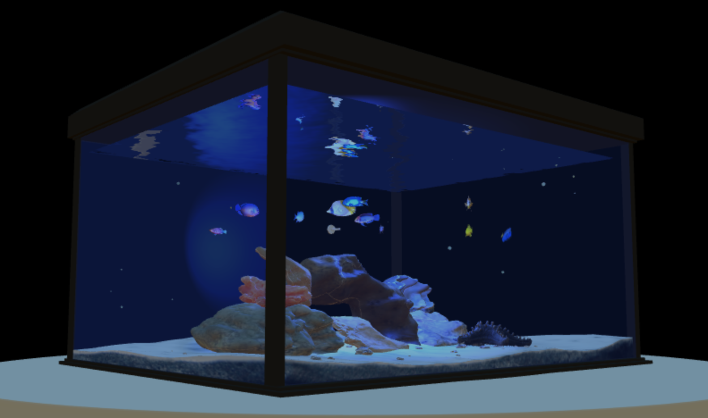

# 3D Virtual Aquarium 🐠



An interactive 3D aquarium simulation built with Three.js featuring realistic water physics, dynamic lighting, and multiple fish species with AI behaviors.

## Features ✨
- 🏊‍♂️ 10+ unique fish models with natural swimming patterns
- 🌊 Real-time water physics with surface shaders
- 🔦 Dynamic lighting system (ambient + spot lights)
- 👓 Multiple camera views (First-person, Third-person)
- ⏳ Water quality degradation system
- 🫧 Bubble particle effects

## Installation 🛠️
```bash
git clone https://github.com/your-username/virtual-aquarium.git
cd virtual-aquarium
npm install
npm start